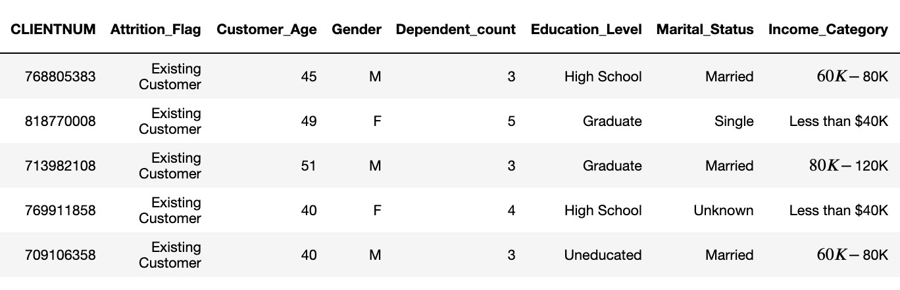

# Predict Customer Churn

- Project **Predict Customer Churn** part of ML DevOps Engineer Nanodegree Udacity

## Project Description
Implement the Machine Learning Dev Operations course learnings to clean the code, analyze, test the code. The machine learning project is to identify credit card customers who are most likely to churn. The completed project will include a Python package for a machine learning project that follows coding (PEP8) and engineering best practices for implementing software (modular, documented, and tested). The package can also be run interactively or from the command-line interface (CLI).

## Files and data description
Overview of the files and data present in the root directory.   

    * data  
        * bank_data.csv
    * images  
        * eda  
            - churn_distribution.png  
            - customer_age_distribution.png  
            - heatmap.png  
            - marital_status_distribution.png  
            - Total_Transaction_distribution.png  
        * results  
            - feature_importances.png  
            - logistic_result.png  
            - rf_result.png  
            - rfc_roc_curve_result.png  
            - roc_curve_result.png  
            - shap_summary.png  
    * logs  
        * churn_library.log
    * models  
        * logistic_model.pkl
        * rfc_model.pkl
    * churn_library.py  
    * churn_library_class.py  
    * churn_notebook.ipynb  
    * churn_script_logging_and_tests.py  
    * churn_script_logging_and_tests_class.py  
    * constants.py  
    * requirements_py3.10.txt  
    * README.md  
    * Makefile

### Data structure
| #   |Column                    |Non-Null Count  |Dtype  |
|---  |------                    |--------------  |-----  |
| 0   |Unnamed: 0                | non-null     |int64  |
| 1   |CLIENTNUM                 | non-null     |int64  |
| 2   |Attrition_Flag            | non-null     |object |
| 3   |Customer_Age              | non-null     |int64  |
| 4   |Gender                    | non-null     |object |
| 5   |Dependent_count           | non-null     |int64  |
| 6   |Education_Level           | non-null     |object |
| 7   |Marital_Status            | non-null     |object |
| 8   |Income_Category           | non-null     |object |
| 9   |Card_Category             | non-null     |object |
| 10  |Months_on_book            | non-null     |int64  |
| 11  |Total_Relationship_Count  | non-null     |int64  |
| 12  |Months_Inactive_12_mon    | non-null     |int64  |
| 13  |Contacts_Count_12_mon     | non-null     |int64  |
| 14  |Credit_Limit              | non-null     |float64|
| 15  |Total_Revolving_Bal       | non-null     |int64  |
| 16  |Avg_Open_To_Buy           | non-null     |float64|
| 17  |Total_Amt_Chng_Q4_Q1      | non-null     |float64|
| 18  |Total_Trans_Amt           | non-null     |int64  |
| 19  |Total_Trans_Ct            | non-null     |int64  |
| 20  |Total_Ct_Chng_Q4_Q1       | non-null     |float64|
| 21  |Avg_Utilization_Ratio     | non-null     |float64|

#### Sample Data

## File Description
| name | description |
| ---- | ------ |
|bank_data.csv  | file containing the customer data|
|churn_library.py  | Module consisting of methods to train and generate the model and artifacts|
|churn_library_class.py  | Class based implementation to train and generate the model and artifacts|
|churn_notebook.ipynb  |Interactive python notebook to develop the model and experiment|
|churn_script_logging_and_tests.py  | pytest code to test the churn_library.py module|
|churn_script_logging_and_tests_class.py  | pytest code to test the class based implementation|
|constants.py  | constants used in the module library|
|requirements_py3.10.txt  | file containting the required libraries for the project|
|Makefile | simplifying option installing, formating, code analysis, testing and execution

## Running Files

1. install the required libraries  
    `python -m pip install -r requirements_py3.10.txt` or `make install`
 
2. formatting the code  
    `autopep8 --in-place --aggressive churn_library_class.py churn_script_logging_and_tests.py` or `make format`  
    `autopep8 --in-place --aggressive churn_library.py churn_script_logging_and_tests.py`   or `make format_module`  

3. code analysis for programming errors  
    `pylint churn_library.py`  or `make pylint_module`  
    `pylint churn_library_class.py`  or `make pylint`  
    `pylint churn_script_logging_and_tests_class.py` or `make pylint_test
    `pylint churn_script_logging_and_tests.py` or `make pylint_test_module

4. Testing the code  
    Test the code as follows  
    `pytest churn_script_logging_and_tests_class.py` OR `make test`-> for class based testing  
    `pytest churn_script_logging_and_tests.py` OR `make test_module`-> for module based testing

5. running the code  
    its build and tested with python 3.10  
    `python churn_library.py` OR `make run_module`-> for python training module  
    `python churn_library_class.py` `make run`    -> for class based python training  
